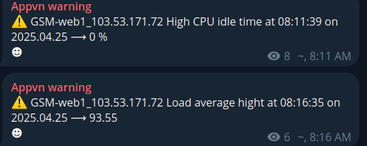
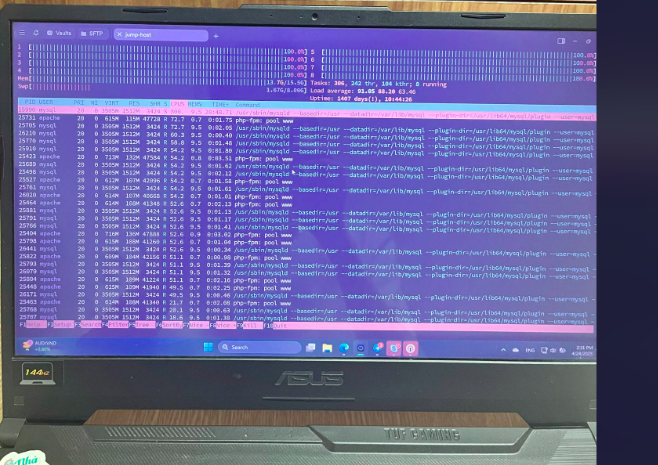
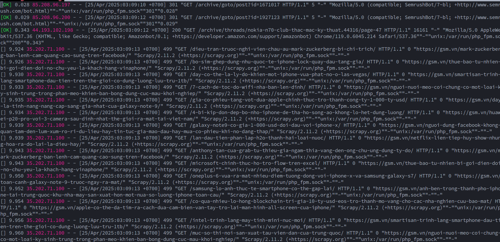

# Xử lý khi Server dính DDOS (giải pháp tạm thời)

## Trong trường hợp hệ thống có phát đi alert về CPU RAM utilization như ảnh bên dưới (Cạn kiệt CPU RAM)



### SSH vào server để xác định nguyên nhân

- Kiểm tra tài nguyên



- Như đã thấy thì **CPU** và **RAM** đang sử dụng quá mức trên 95%


- Tiếp đến check logs web server để kiểm tra truy cập (tùy thuộc vào ứng dụng đang chạy là gì để check file access logs của ứng dụng đó)


```bash 


tail -f /var/log/nginx/forum.gsm.access.log
```



- Như trên access logs file trên thì có 1 IP đáng ngờ là **35.202.71.100** vì:

1. Tần suất xuất hiện IP cao bất thường

```bash 
9.933 35.202.71.100
9.935 35.202.71.100
9.939 35.202.71.100
...
9.960 35.202.71.100


```
2. User-Agent đáng nghi: 

```bash 
"Scrapy/2.11.2 (+https://scrapy.org)"

1. Đây là thư viện crawler Python phổ biến.
2. Bot hợp pháp như Googlebot hoặc Bingbot thường sẽ có User-Agent rõ ràng và uy tín.
3. Còn Scrapy thì ai cũng dùng được => block được luôn nếu không cần mở public crawl.
``` 

3. HTTP Status code: 499 **Mã 499 là client tự đóng kết nối (nghĩa là bot chạy không bình thường, có thể gây tải cao).**

4. Request gọi không thành công: Có thể thấy thì các IP hợp lệ sẽ có trạng thái **[OK]** ở đầu còn các request từ Bot IP thì không 

- Có [ ] nghĩa là request không thành công.

- Trong dòng có mã HTTP 499, là mã của Nginx báo client tự cắt kết nối.

- 9.935 là thời gian xử lý request đó, tận 8.5 giây, rất bất thường.

- Dùng User-Agent là Scrapy/2.11.2, quá rõ là bot tự viết.

### Kết luận nên block IP **35.202.71.100** (block 80 443 là đủ)

```bash 
iptables -A INPUT -s 35.202.71.100 -p tcp --dport 443 -j DROP 
iptables -A INPUT -s 35.202.71.100 -p tcp --dport 80 -j DROP 
```
