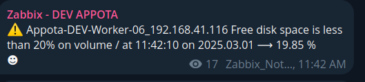
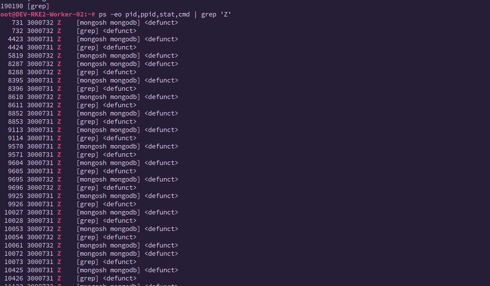
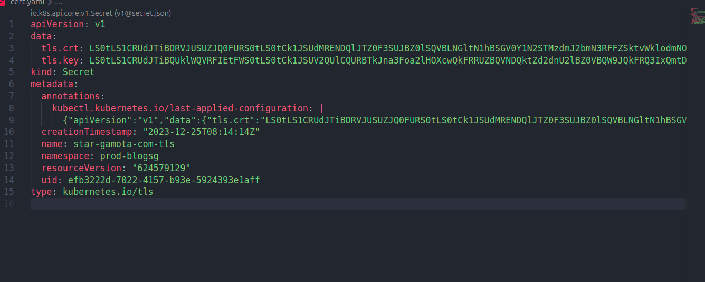

## Normal Cluster

## RKE


### Free disk space in worker-node



1. Thường cụm đầy disk là do có quá nhiều images layer cũ và các images ko sử dụng nữa chứ ko phải do logs (logs chiếm ít disk có thể chưa
đến 1GB)
2. Trong trường hợp node không có crictl:

```bash
echo "export CRI_RUNTIME_ENDPOINT=unix:///run/k3s/containerd/containerd.sock" >> ~/.bashrc
echo "export PATH=$PATH:/var/lib/rancher/rke2/bin" >> ~/.bashrc
source  ~/.bashrc


# remove all unused images
/var/lib/rancher/rke2/bin/crictl --runtime-endpoint unix:///run/k3s/containerd/containerd.sock rmi --prune
crictl images --prune

```


### Clear process in worker-node


1. Trong trường hợp worker báo có quá nhiều process đang chạy thì ta sẽ xóa các zombie process

- List ra các số lượng các process dùng lệnh **top**


- Kiểm tra số lượng các process đang chạy

```bash

root@DEV-RKE2-Worker-02:~# ps aux | wc -l
634
```

- Lấy ra danh sách các process **zombie process** đang chạy

```bash

root@DEV-RKE2-Worker-02:~# ps -eo pid,ppid,stat,cmd | grep 'Z' # kiểm tra các zombie process, bao gồm PID PPID ,...

```


> Từ output, cha của các zombie process (PPID) là 3000731 và 3000732.

-  Chạy lệnh sau để xóa chúng:

```bash
root@DEV-RKE2-Worker-02:~# kill -9 3000731 3000732

root@DEV-RKE2-Worker-02:~# ps -eo pid,ppid,stat,cmd | grep 'Z'


```



> Tìm hiểu thêm về process trong Linux: [Basic Process Management](https://viblo.asia/p/basic-process-management-quan-ly-tien-trinh-trong-unixlinux-co-ban-LzD5der0KjY)