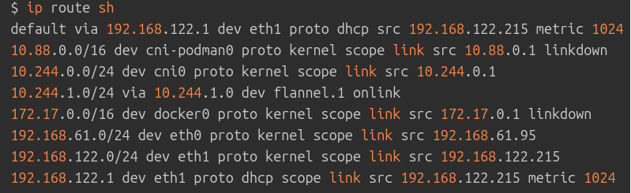

# Hành Trình Của Một Packet trong VXLAN

Mục tiêu của VXLAN là tạo ra ảo giác rằng tất cả các Pod đều nằm trên cùng một mạng phẳng lớn, ngay cả khi chúng phân tán trên nhiều node vật lý khác nhau. Nó làm điều này bằng cách "đóng gói" (encapsulate) packet gốc của Pod bên trong một packet UDP/IP bên ngoài. Packet UDP/IP này sau đó được định tuyến qua mạng vật lý giữa các node.


## Giả định cấu hình VXLAN điển hình:

- Mỗi Pod có một cặp giao diện mạng ảo **veth pair**. Một đầu của **veth pair** nằm trong network namespace của Pod, đầu còn lại nằm trong network namespace gốc của Node.
- Trên mỗi Node, đầu **veth** của Pod nằm trong namespace gốc được gắn vào một **Linux bridge** ảo (ví dụ: `cbr0`, `docker0`, hoặc bridge do CNI tạo). Bridge này hoạt động như một switch ảo, kết nối tất cả các Pod trên cùng Node.
- Trên mỗi Node cũng có một giao diện **VXLAN** (ví dụ: `flannel.1`, `weave`, `vxlan0`). Giao diện này chịu trách nhiệm đóng gói và giải đóng gói packet VXLAN.
- Hệ thống định tuyến trên mỗi Node được cấu hình để biết rằng Pod CIDR của các Node khác có thể truy cập được thông qua giao diện VXLAN của Node đó.

---

## Đường đi chi tiết của Packet (Mode VXLAN):

### 1. Packet rời Pod A (Node 1):

- Pod A muốn gửi packet đến Pod B (địa chỉ IP ví dụ: `10.244.2.5`).
- **Packet được tạo ra với**:
  - **Source IP**: IP của Pod A (ví dụ: `10.244.1.3`).
  - **Destination IP**: IP của Pod B (`10.244.2.5`).
  - **Source MAC**: MAC của giao diện `eth0` (hoặc tên tương tự) trong Pod A.
  - **Destination MAC**: MAC của gateway mặc định của Pod A, chính là đầu **veth** của nó nằm trong namespace gốc của Node 1.
- Packet rời khỏi **network namespace** của Pod A thông qua đầu **veth** bên trong Pod.

### 2. Packet đi vào Node 1 (qua veth pair và Bridge):

- Packet xuất hiện ở đầu **veth** còn lại của Pod A nằm trong **network namespace** gốc của Node 1.
- Đầu **veth** này được gắn vào **Linux bridge** (ví dụ: `cbr0`).
- Bridge tra cứu bảng MAC của nó để tìm MAC address của địa chỉ IP đích (`10.244.2.5`). Tuy nhiên, vì `10.244.2.5` nằm ngoài bridge này, bridge sẽ gửi packet lên lớp mạng cao hơn để xử lý định tuyến.

### 3. Routing trên Node 1:

- Hệ điều hành Node 1 nhận packet từ bridge.
- Hệ điều hành tra cứu bảng định tuyến của Node 1.
- Bảng định tuyến của Node 1 có một route cho dải IP của Pod B (`10.244.2.0/24`). Route này chỉ ra rằng để tới dải IP này, packet cần được gửi qua giao diện **VXLAN** của Node 1 (ví dụ: `flannel.1`).

> Check bằng lệnh **ip route sh** để thấy routing từ pod đến card mạng của CNI (chạy lệnh trên node mà chứa pod cần check), ví dụ khi chạy lệnh thì output sẽ ra như này:



### 4. Đóng gói VXLAN (Encapsulation) trên Node 1:

- Packet gốc (`Source IP: 10.244.1.3, Dest IP: 10.244.2.5`) được chuyển đến giao diện **VXLAN** (`flannel.1`).
- Giao diện VXLAN biết rằng Pod CIDR `10.244.2.0/24` thuộc về Node 2 (địa chỉ IP vật lý ví dụ: `192.168.100.102`).

> Lý do mà VXLAN có thể biết rằng CIDR `10.244.2.0/24` thuộc về Node 2 (`192.168.100.102`) là do khi CNI sử dụng mode VXLAN thì các CIDR của Pod sẽ có 1 tunnel được nối đến các worker-node. Chạy lệnh **cilium bpf tunnel list** ở trong 1 Pod cilium để có thông tin:

```golang 
$ kubectl exec -n kube-system cilium-4bk46 -- cilium bpf tunnel list
                                                                                
> Here is the output:                                                             
                                                                                
  TUNNEL     VALUE                                                              
  10.0.4.0   192.168.10.168:0                                                   
  10.0.3.0   192.168.10.169:0                                                   
  10.0.1.0   192.168.10.204:0                                                   
  10.0.0.0   192.168.10.162:0     
```

- Giao diện VXLAN đóng gói packet gốc bằng cách thêm các header mới:
  - **Inner Header**: Packet gốc của Pod (IP header, TCP/UDP header, data).
  - **VXLAN Header**: Thêm một VXLAN header nhỏ, chứa **VNI** (VXLAN Network Identifier) để phân biệt các mạng overlay khác nhau nếu có.
  - **Outer UDP Header**: Thêm một UDP header với port đích là 8472 (port của VXLAN).
  - **Outer IP Header**:
    - **Source IP**: IP vật lý của Node 1 (ví dụ: `192.168.100.101`).
    - **Destination IP**: IP vật lý của Node 2 (ví dụ: `192.168.100.102`).
  - **Outer Ethernet Header**: Thêm một Ethernet header mới với MAC đích là MAC của router/gateway tiếp theo trên mạng vật lý để đến Node 2.
- Lúc này, packet trông giống như một packet UDP thông thường đi từ IP vật lý của Node 1 đến IP vật lý của Node 2.

### 5. Packet đi qua Mạng Vật lý:

- Packet đã được đóng gói VXLAN được gửi ra card mạng vật lý của Node 1 (ví dụ: `eth0`).
- Packet được định tuyến qua mạng vật lý, sử dụng các router và switch thông thường, giống như bất kỳ packet IP nào khác đi giữa Node 1 và Node 2.
- Packet cuối cùng đến card mạng vật lý của Node 2.

### 6. Packet đi vào Node 2 (qua card mạng vật lý và Giao diện VXLAN):

- Card mạng vật lý của Node 2 nhận packet UDP có đích là IP vật lý của Node 2 và port 8472.
- Kernel của Node 2 nhận diện packet này dành cho giao diện **VXLAN** (`flannel.1`) vì nó đến trên port 8472.
- Packet được chuyển đến giao diện VXLAN.

### 7. Giải đóng gói VXLAN (Decapsulation) trên Node 2:

- Giao diện VXLAN trên Node 2 nhận packet đóng gói.
- Nó kiểm tra VXLAN header và ID mạng (VNI).
- Nó bóc tách (remove) **Outer Ethernet**, **Outer IP**, **Outer UDP** và **VXLAN headers**.
- Packet gốc của Pod (với `Source IP: 10.244.1.3, Dest IP: 10.244.2.5`) được phục hồi.

### 8. Routing và đi vào Pod B (Node 2):

- Packet gốc đã được giải đóng gói được chuyển đến stack mạng của Node 2.
- Kernel của Node 2 tra cứu bảng định tuyến cho packet có đích là `10.244.2.5`.
- Bảng định tuyến của Node 2 cho thấy địa chỉ `10.244.2.5` nằm trong dải Pod CIDR của chính Node 2 (`10.244.2.0/24`).
- Packet được chuyển đến **Linux bridge** (`cbr0` hoặc tương tự) mà tất cả các Pod trên Node 2 được gắn vào.
- Bridge tra cứu bảng MAC của nó và tìm thấy rằng địa chỉ MAC tương ứng với IP `10.244.2.5` có thể truy cập được thông qua đầu **veth** của Pod B gắn vào bridge.
- Bridge đẩy packet ra đầu **veth** này.

### 9. Packet đi vào Pod B (Node 2):

- Packet đi qua **veth pair** và đi vào **network namespace** của Pod B.
- Pod B nhận được packet gốc từ Pod A.

---


## Tóm tắt:

- Packet từ Pod A đến Pod B (khác node) được đóng gói bên trong một packet UDP/IP giữa hai Node vật lý.
- Node nguồn thực hiện đóng gói (encapsulation) VXLAN dựa trên bảng định tuyến Pod CIDR.
- Mạng vật lý chỉ định tuyến packet UDP/IP giữa các Node. Nó không quan tâm đến IP gốc của Pod.
- Node đích thực hiện giải đóng gói (decapsulation) VXLAN.
- Packet gốc được trả lại stack mạng của Node đích và sau đó được định tuyến cục bộ đến Pod đích thông qua bridge và veth pair.

Chế độ VXLAN cho phép tạo ra một mạng overlay đơn giản, không yêu cầu cấu hình định tuyến phức tạp trên mạng vật lý cho từng Pod CIDR. Mạng vật lý chỉ cần có khả năng định tuyến giữa các Node Kubernetes.
